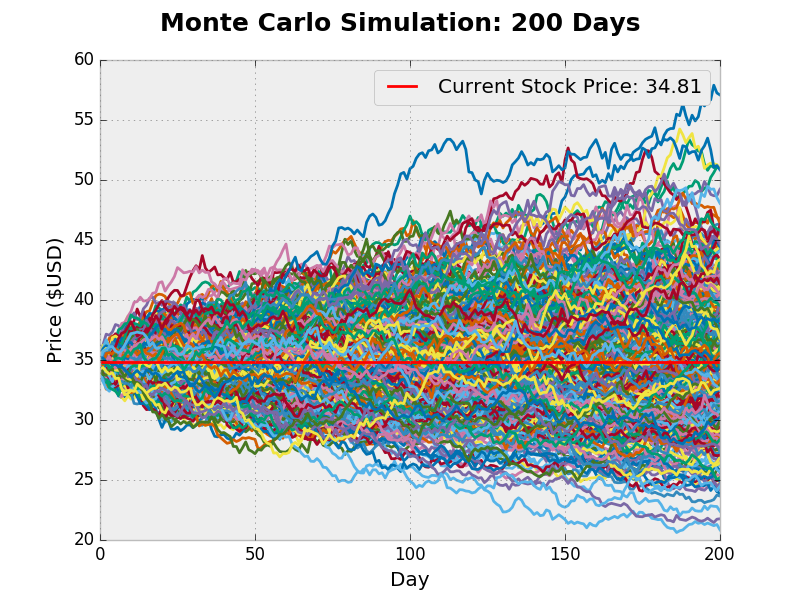
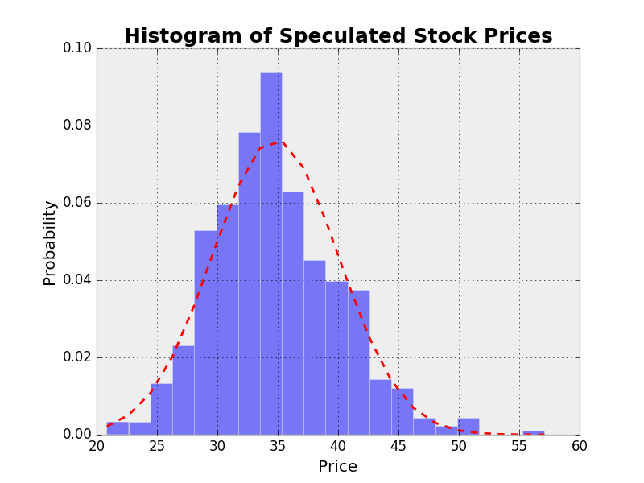
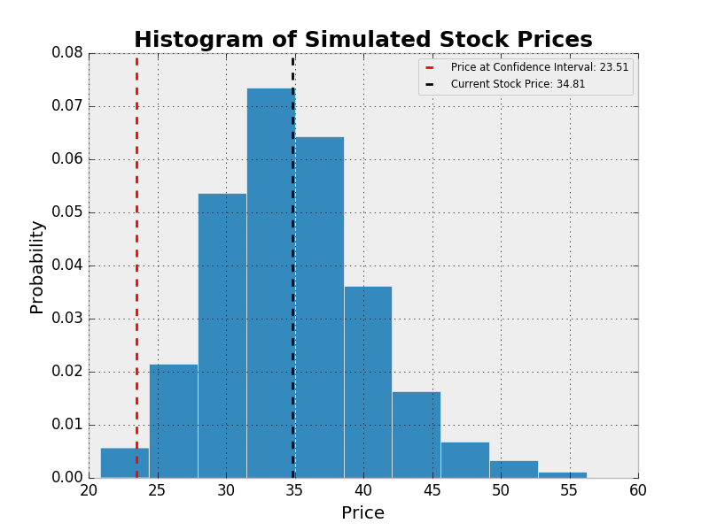

# Monte-Carlo-Simulation-Portfolio
A Monte Carlo simulation is a method that allows for the generation of future potential outcomes of a given event. In this case, we are trying to model the price pattern of a given stock or portfolio of assets a predefined amount of days into the future. With Python, R, and other programming languages, we can generate thousands of outcomes on the potential price pattern of a stock. We are much better off running Monte Carlo Simulations with programming languages rather than Excel. Excel simply does not provide the computational necessary to efficiently and quickly run thousands of trials. You could use Excel if you want, but it is extraordinarily inefficient.

Let’s get a better understanding of the background of Monte Carlo simulations specifically being applied to the stock market. The reality of the matter is that Monte Carlo simulations aren’t just used to generate future stock prices. In fact, they are often used to estimate risk! For example, Value at Risk is often calculated using a Monte Carlo method, where we would be using theoretical future data rather than historical data. We could include a method in the class we will build below to estimate Value at Risk over a given confidence interval with our generated stock prices. The key takeaway from Monte Carlo simulations is the fact that there is some sort of random variable involved. The stock market is a perfect application of a model that uses a type of Monte Carlo simulation due to the level of statistical noise within the markets. We are trying to model the probability of different outcomes, simple as that.

In the script I wrote, the intention was to design a class that could use different Monte Carlo methods, and different graphical outputs of the simulation with descriptive statistics as well. Note we can use a single ticker or portfolio of assets in the simulation. We also have multiple models we can use.

***Model 1 – Simulation using daily volatility:***

Pretty straightforward. The random “shock” element here will be determined by the historical volatility of a stock over a given timeframe.

***Model 2 – Simulation using Brownian Motion:***

Here, we are assuming the stock(s) will “drift” a certain amount over time. We can calculate this with the average daily return in our series as well as the variance of the returns. This post will not cover the background of the simulation techniques extensively. We are trying to focus on implementing the models in a program.

# Examples

